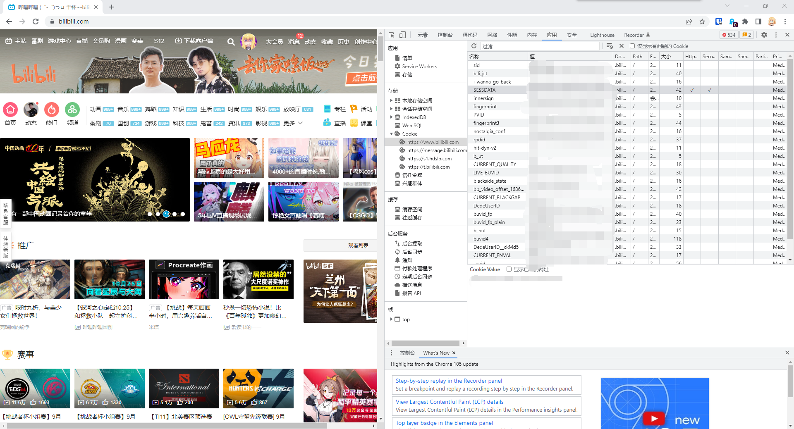
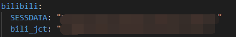

# 部署指南

DDBOT的部署较为容易，只需几步，即可获得一个专属于你的DDBOT。

请按照下面的步骤依次进行。

## 准备工作

- 准备一台电脑，并装好浏览器

- 准备一部手机，并装好手机QQ

- 准备两个QQ帐号

  你需要准备一个不常用的QQ（俗称小号），将这个QQ做为BOT帐号，**后面将使用`BOT帐号`代指这个QQ**。

  另一个QQ号用来控制BOT，**后面将使用`管理员帐号`代指这个QQ**。

  如果这两个QQ还不是好友，请手动互加好友。

- 就这么多，请继续看下一节

## 下载DDBOT

请访问DDBOT[下载页面](https://github.com/Sora233/DDBOT/releases/latest)。

下载页面中共有超过20个版本的DDBOT，这是因为DDBOT支持Windows、Linux、MacOS等多个平台以及不同架构。

你只需要下载一个适合你的版本即可。

如果你不知道哪个版本适合你，推荐选择`DDBOT-vX.X.X-windows-amd64.zip`。

## 运行DDBOT

如果你还没有解压下载好的DDBOT，请将它解压出来。**（请不要双击压缩包里的DDBOT来运行）**

将DDBOT程序放入一个单独的目录中，双击运行它，将会启动一个黑色命令框，第一次启动时将会花费几秒钟时间初始化，随后命令框内将显示一个二维码。

:::danger 错误
如果你双击运行程序的时候出现：

说明你下载了不适合你的DDBOT版本，请确认你下载的是：`DDBOT-vX.X.X-windows-amd64.zip`
:::

这时请拿出上一步准备好的手机，打开手机QQ，登录 **`BOT帐号`**，并用手机QQ扫描二维码。

观察黑色命令框，如果你看到命令框内有显示：


恭喜你，你已经成功启动了一个DDBOT。

现在，**请保持DDBOT运行**，然后使用电脑或手机登陆 **`管理员帐号`**，并对 **`BOT帐号`** 私聊发送：

```shell
/whosyourdaddy
```

BOT将会回复你：

```text
成功 - 您已成为bot管理员
```

:::danger 错误
如果你没有收到回复，检查是否一直保持DDBOT处于运行状态。

如果仍无法解决，请点击页面右上角的需要帮助。
:::

如果一切正常，你已经获得了BOT的最高权限。

当你顺利地操作到了这里，那你已经学会了和BOT交互的方式：发送QQ消息。

接下来让我们开始使用BOT，请邀请BOT创建一个群聊。（这个群聊是为了让你测试BOT有在正常工作，当你测试完成后，可以解散群聊。）

让我们来测试一下BOT的推送功能。

首先打开B站，登陆你的帐号，打开你的个人主页，找到你的UID。

我的UID为 **`97505`**，在下面的例子中我将用我的UID来演示。

**当你实际进行测试的时候，请把我的UID替换成你的UID**。

完成后打开群聊，在群聊内发送：

```shell
# 注意把我的UID替换成你实际的UID
/watch --type news 97505
```

如果BOT回复你：

```text
watch成功 - bilibili用户 你的B站名字
```

这个命令会订阅用户的动态信息，当你输入的是你的UID时，你就订阅好了你B站帐号的动态推送。

接下来你可以去B站发送一条动态，并等待1分钟。

如果BOT把刚刚发送的B站动态转发到了QQ群聊里，说明BOT正在正常工作。（你可以删掉刚刚的动态）

:::danger 错误
如果BOT超过一分钟没有转发，请检查：

- 你订阅的UID是否和你发动态的UID一致
- 你的B站动态是否被审核
- 黑色命令框内是否出现错误

:::

如果一切正常，请你对BOT私聊发送：

```shell
/help
```

BOT会告诉你一些最常用的功能，你可以继续在群里进行测试。

当你完成之后，你就已经会使用DDBOT的订阅推送功能了。

## 配置DDBOT

TODO

## 常见问题

这里为你准备了一些常见问题，如果你是DDBOT新手，推荐你进行阅读。

记住，如果你遇到问题，随时可以点击页面右上角的需要帮助。

- ### DDBOT需要一直运行吗？

是的，你无法在DDBOT没有运行的情况下使用它。

常用方法是使用云服务器运行DDBOT。

这是最推荐的做法，不必觉得云服务器离我们很远，它就是一台被设计来24小时运行的**电脑**，并且早已是现代互联网的一部分。

如果你还没有用过它，那可能是因为过去你没有遇到需要用到它的地方，而现在，使用云服务器去运行DDBOT，可以成为一个好的理由。

推荐的云服务器提供商：[腾讯云](https://cloud.tencent.com/)，[阿里云](https://cn.aliyun.com/)。

- ### 发送群消息失败，可能是被禁言或者账号被风控

TODO

- ### 如何获取B站Cookie

------

::: tip 提示
本页使用Google Chrome为教程，
即使用Chromium内核开发的浏览器均可使用，例如[Edge、360浏览器等]。
Gecko内核(FireFox)基本通用，但在不同点会做出提示。
:::

1、打开浏览器。

2、进入[bilibili](https://www.bilibili.com)。

3、请确保你已登录bilibili账号！

4、在B站主页按下 **F12** 键打开开发者工具箱(DevTools)。


5、点击 **`应用(Application)->Cookie->https://www.bilibili.com`** (二级域名为bilibili都即可)。



::: tip 提示
FireFox打开开发者工具箱(DevTools)与以上方法相同(即按F12)。

但Cookie则在 **`存储->Cookie中`**
:::

6、在选择二级域名为bilibili的Cookie中找到 **`名称(name)bili_jct和SESSDATA，并将值(key)`** 复制记录下来。

::: warning 警告
注意！你获取的是B站账号所登录设备的Cookie。当你的账号在该设备下线，该Cookie会被作废导致DDBOT无法登录。
建议在Windows系统下的服务器上登录B站账号并在服务器上获取Cookie，来保证DDBOT所使用的Cookie不会被作废！

Cookie有过期时间，如因时间过期可提供该方法重新获取。
:::

7、打开DDBOT的 **`application.yaml`** 文件，将获取的Cookie粘贴到对应的参数中！



::: warning 警告
请不要对他人公开你的Cookie！Cookie可作为钥匙直接登录你的B站账号！

你也不想让别人在你家偷窥你对吧！
:::

8、确定无误后启动DDBOT即可。

::: danger 错误
在使用一段时间后发现DDBOT提示 **`-401`** 错误时，请检查：
 - Cookie是否过期
 - 收集Cookie的设备是否下线bilibili。

 如以上错误及时获取新的Cookie并更换即可。
:::
