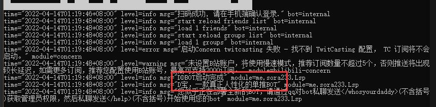

# 部署指南

DDBOT的部署较为容易，只需几步，即可获得一个专属于你的DDBOT。

请按照下面的步骤依次进行。

## 准备工作

- 准备一台电脑，并装好浏览器。

- 准备一部手机，并装好手机QQ。

- 准备两个QQ帐号

  你需要准备一个不常用的QQ（俗称小号），将这个QQ做为BOT帐号，**后面将使用`BOT帐号`代指这个QQ**。

  另一个QQ号用来控制BOT，**后面将使用`管理员帐号`代指这个QQ**。

  如果这两个QQ还不是好友，请手动互加好友。

- 就这么多，请继续看下一节

## 启动DDBOT

请访问DDBOT[下载页面](https://github.com/Sora233/DDBOT/releases/latest)。

下载页面中共有超过20个版本的DDBOT，这是因为DDBOT支持Windows、Linux、MacOS等多个平台以及不同架构。

你只需要下载一个适合你的版本即可。

如果你不知道哪个版本适合你，推荐选择`DDBOT-vX.X.X-windows-amd64.zip`。

## 运行DDBOT

如果你还没有解压下载好的DDBOT，请将它解压出来。**（请不要双击压缩包里的DDBOT来运行）**

将DDBOT程序放入一个单独的目录中，双击运行它，将会启动一个黑色命令框，第一次启动时将会花费几秒钟时间初始化，随后命令框内将显示一个二维码。

:::danger 错误
如果你双击运行程序的时候出现：

说明你下载了不适合你的DDBOT版本，请确认你下载的是：`DDBOT-vX.X.X-windows-amd64.zip`
:::

这时请拿出上一步准备好的手机，打开手机QQ，登录 **`BOT帐号`**，并用手机QQ扫描二维码。

观察黑色命令框，如果你看到命令框内有显示：



恭喜你，你已经成功启动了一个DDBOT。

现在，请保持DDBOT运行，然后使用电脑或手机登陆 **`管理员帐号`**，并对 **`BOT帐号`** 私聊发送：

```shell
/whosyourdaddy
```

BOT将会回复你：

```text
成功 - 您已成为bot管理员
```

如果你没有收到回复，检查是否一直保持DDBOT处于运行状态。

如果仍无法解决，请点击页面右上角的需要帮助。

## 配置DDBOT

TODO